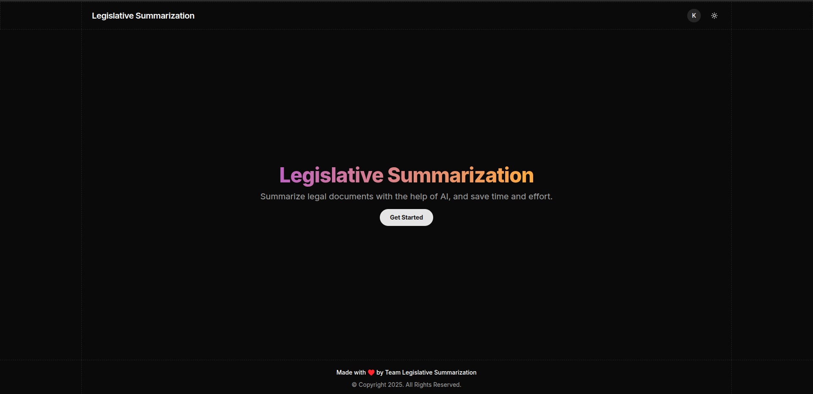
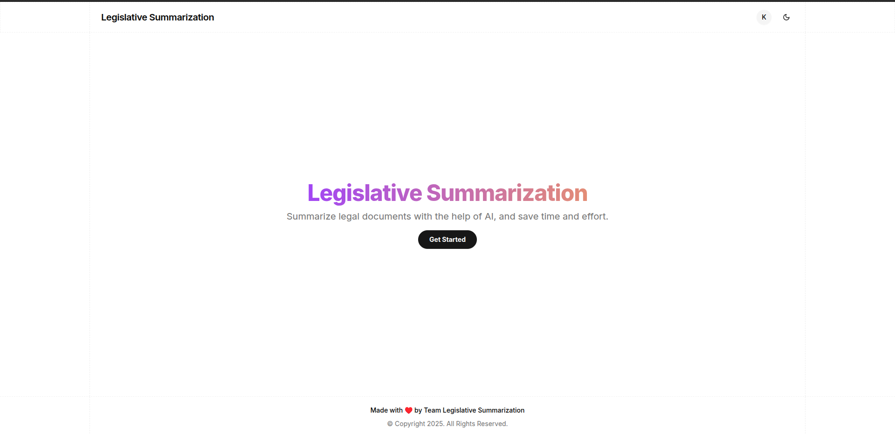
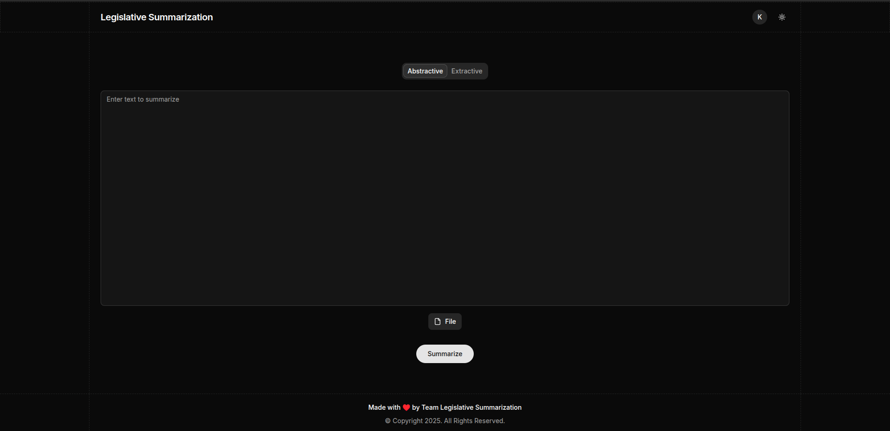
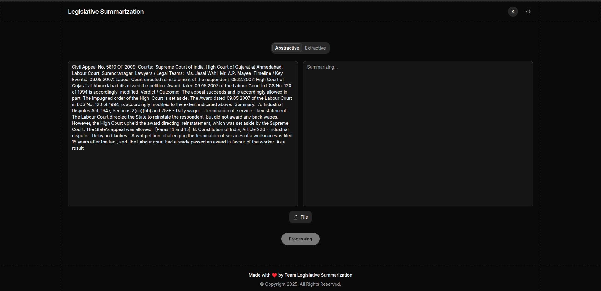
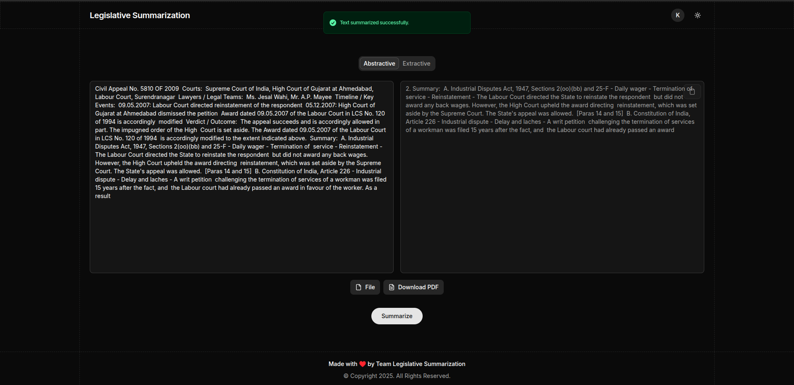

# Legislative Summarization

Summarize legal documents with the help of AI, and save time and effort.

---

|                    Dark Theme                     |                     Light Theme                     |
| :-----------------------------------------------: | :-------------------------------------------------: |
|  |  |

## How to Use

1. **Upload** any PDF, DOCX, or plain‑text legal document.
2. **Choose** the desired summary length or detail level.
3. **Generate** and receive an AI‑powered summary in seconds.
4. **Export** the summary to PDF.

### Screenshots

|                Initial View                |                  Summarizing                   |               Finished Summary               |
| :----------------------------------------: | :--------------------------------------------: | :------------------------------------------: |
|  |  |  |

### Tech Stack

- **Frontend:** React + TypeScript + Tailwind
- **Backend:** Bun + Express
- **Storage:** PostgreSQL with Prisma ORM
- **Auth:** JWT + Authenticator
